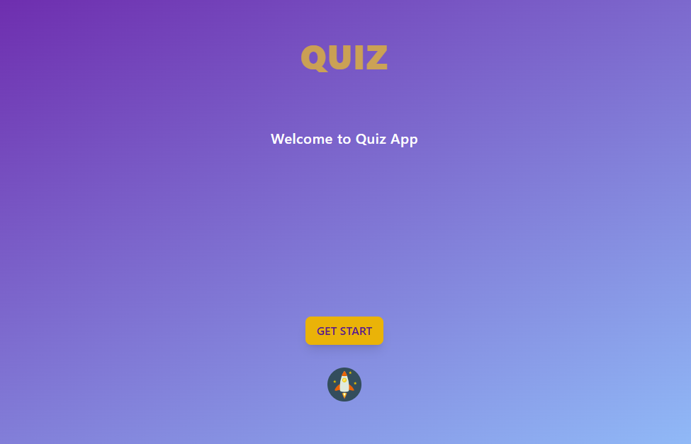
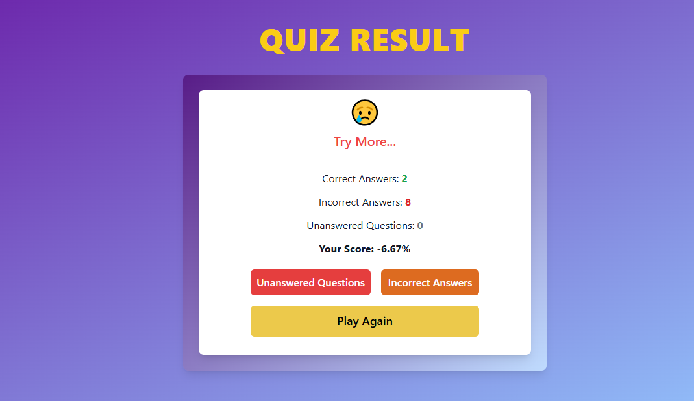

# Quiz Application

A modern, interactive quiz application built with React that allows users to test their knowledge through engaging quizzes.

## 🚀 Features

- Interactive quiz interface
- Multiple choice questions
- Real-time score tracking
- User-friendly interface
- Immediate feedback on answers
- Progress tracking
- Score summary at the end of each quiz

## 📋 Technologies Used

- React.js
- CSS3
- React Hooks
- React Router (for navigation)
- Local Storage (for saving progress)

## ScreenShots







## 📋 Prerequisites

Before you begin, ensure you have the following installed:

- Node.js (version 14.0.0 or higher)
- npm (version 6.0.0 or higher)

## 🚀 Getting Started

1. Clone the repository:

```bash
git clone https://github.com/Parisa-Esmaeilpour1993/Quiz-App
```

2. Navigate to the project directory:

3. Install dependencies:

```bash
npm install
```

### Running the Application

1. Start the development server:

```bash
npm run dev
```

2. Open your browser and enjoy
